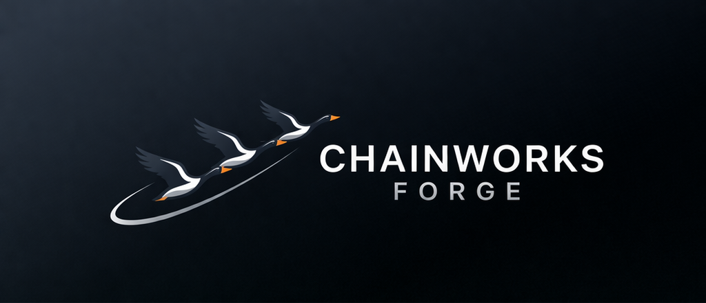

# Chainworks Forge

<p align="center">
  
</p>

Chainworks Forge is a macOS SwiftUI control plane for agent-driven engineering workflows.

It is built around one idea: the primary object is not a chat thread. It is a **Run**.
A run takes one idea, compiles a frozen workflow snapshot, routes work through specialized agents, pauses at explicit approval gates, stores durable artifacts, and leaves behind a truthful report of what happened.

## Why This Project Exists

Chainworks Forge did not start as a generic AI chat app.
It started from a practical frustration: too much engineering work was still happening through repetitive manual steps.

The first version of the idea was much closer to "a workflow orchestrator on top of `goosed`."
After experimenting with Goose and seeing how interesting multi-agent coordination could become when different agents had different roles, parameters, and responsibilities, the project expanded from a thin wrapper into a real operator-facing workflow system.

The turning point was simple: once the workflows became useful, too many important actions still depended on manual coordination.
That pushed the project toward a stricter model:

- workflows instead of ad hoc prompt chains
- explicit agent roles instead of one general-purpose assistant
- durable artifacts and reports instead of ephemeral chat history
- approval gates instead of invisible autonomous continuation
- runtime abstraction instead of hard-coding one backend forever

That is why the runtime story changed as well.
The project originally leaned on Goose and `goosed` as the practical execution substrate.
Today, the product is moving away from Goose as the canonical transport model and toward a set of ACP-backed runtimes such as Codex, Claude Code, and Gemini.
Goose still matters as legacy and compatibility infrastructure, but it is no longer the long-term center of the design.

## What The App Does

- captures ideas as units of engineering work
- executes YAML-defined workflows instead of hardcoded chat flows
- routes proposal reviews deterministically based on evidence and a specialist catalog
- binds specialized agents to providers, models, permissions, and output contracts
- preserves run state, stage history, approvals, and artifact metadata in the backend (read by the UI via GraphQL projections)
- stores generated artifacts on disk instead of hiding execution inside chat history
- supports recovery, comparison, reporting, and approval-driven continuation
- keeps repo-backed delivery and release work behind explicit gates

In practice, Chainworks Forge sits between ad hoc AI chats and heavyweight orchestration systems: local-first, inspectable, and built for one engineer running governed multi-agent workflows from a desktop app.

## Product Direction

The current direction is:

- ACP-first runtime transport
- thin GraphQL-only operator UI over server-owned projections
- frozen run truth and operator-visible recovery
- backend-specific agent tuning through catalog-defined workflows
- local-first execution with explicit provider/runtime diagnostics
- compatibility retained where useful, but not treated as the long-term architecture

The project is intentionally opinionated.
It assumes that workflow truth, artifacts, approvals, and recovery matter more than "just keep chatting," especially once multiple agents, repos, and delivery steps are involved.

## Core Concepts

| Concept | Meaning |
|---|---|
| `Idea` | A user-entered piece of work, optionally tied to files or a workspace. |
| `Workflow` | A YAML-defined execution graph with stages, approvals, transitions, and agent references. |
| `Run` | One execution instance of a workflow for one idea. This is the main operational object in the system. |
| `RunPlanSnapshot` | The frozen workflow, catalog, provider binding, and path snapshot compiled at run start. |
| `Agent` | A specialized worker with explicit role, provider binding, tool access, and output contract. |
| `Artifact` | Durable output such as a proposal, review report, diff, transcript, receipt, or run report. |
| `Approval gate` | A workflow-defined pause where the engineer must explicitly continue. |

## Current Product Shape

Today the app exposes these top-level operator surfaces through the thin GraphQL read boundary:

- `Runs Home` for active, blocked, running, and completed runs (GraphQL-only)
- `Ideas` for capturing and managing work (Create Idea is outside the governed thin UI write path)
- `Approvals` for pending human decisions (supported in-app via GraphQL write transport; diagnostic-only for external resolution)
- `Agent Catalog` for inspecting the resolved agent catalog
- `Workflow Inspector` for YAML workflow inspection and validation
- `Pilot Readiness` for readiness and sign-off support
- `Settings` for provider configuration, diagnostics, and remediation

The current MVP provider set is:

- `Codex`
- `Claude Code`
- `Gemini`

## Current Status

The repository is past the scaffold stage. The implemented system now includes:

- lead-mediated workflow conflict resolution and mandatory lead validation
- thin GraphQL-only UI rewrite (P031) ensuring all production truth is read from server projections
- frozen run snapshots, YAML validation, provenance, and deterministic execution truth
- declarative workflow authority, typed workflow conflicts, and advisory rejection history
- operator-facing run, approval, report, recovery, and comparison surfaces
- provider configuration, remediation, ACP-backed execution slices, and legacy Goose compatibility paths
- local Rust daemon lifecycle, supervision, packaged-mode health/readiness, diagnostics, and release-host packaging proof lanes
- repo-backed delivery, release gating, benchmark/sign-off, and export flows
- provider toolchain cache mapping ensuring isolated writable roots for Xcode and Go
- Run Worktree Main Sync and Cross-Run Knowledge Transfer (Proposal 064 Phase 0 contract freeze)
- implementation completeness and handoff contract with structured status and verification truth
- bounded implementation closeout readiness gates (Proposal 077) ensuring proposal-specific proof and audit coverage before release
- deterministic reviewer routing and expanded proposal reviewer catalog
- stable reference documentation under [`docs/reference`](docs/reference)
- proof artifacts under [`docs/evidence`](docs/evidence)
- stable proposal-loop feedback-fidelity documentation and proof under [`docs/reference`](docs/reference) and [`docs/evidence`](docs/evidence)

Active proposal work is currently concentrated in:

- [`docs/proposals/032-polish-stabilization-and-productization-backlog.md`](docs/proposals/032-polish-stabilization-and-productization-backlog.md)
- [`docs/proposals/036-ux-consolidation-and-navigation-simplification.md`](docs/proposals/036-ux-consolidation-and-navigation-simplification.md)
- [`docs/proposals/020-dynamic-cycle-addition.md`](docs/proposals/020-dynamic-cycle-addition.md)

The canonical thin UI contract is [`docs/reference/query-projections-and-client-consumption-contract.md`](docs/reference/query-projections-and-client-consumption-contract.md). New UI proposals should build on that reference rather than historical proposal text. The docs index at [`docs/README.md`](docs/README.md) is the canonical map of implemented references, active proposals, evidence, and historical review material.

## Implemented Today

The repository is no longer a scaffold. It already contains the core control-plane and runtime slices:

- SwiftUI macOS app shell with operator-facing tabs and recovery/report surfaces
- SwiftData models for ideas, runs, stages, approvals, artifacts, benchmark/sign-off state, and provider state
- YAML parsing, validation, normalization, and frozen provenance snapshotting
- run compilation and execution services:
  - `RunPlanCompiler`
  - `TransitionEvaluator`
  - `ExecutionService`
  - `WorkflowOrchestrator`
  - `ResumeManager`
  - Capacity-aware scheduling, fairness, executor backpressure, SQLite write serialization, and host interruption recovery (Rust daemon)
- artifact persistence and retrieval:
  - `ArtifactStorage`
  - `ArtifactManager`
  - `bounded artifact discovery and settlement optimization`
  - report/export surfaces
- provider platform slices:
  - provider settings
  - pilot readiness
  - ACP-oriented runtime dispatch and provider bindings
  - Goose compatibility diagnostics and remediation
  - frozen provider/model provenance truth
- local daemon lifecycle slice:
  - typed health/readiness and `daemonStatus` readback
  - packaged app/helper supervision with PID lock and crash budget
  - SQLite migration preflight, failed-serve status, diagnostics export, and packaged daemon proof lanes
- repo-backed delivery slice:
  - worktree provisioning
  - delivery configuration freezing
  - release gate UI
  - evidence/export paths
- MVP sign-off layer:
  - persisted benchmark/sign-off state
  - completed-run export hub
  - replayable `GO/HOLD` decision snapshots
  - approved-host current-head proof gates
- layered test gates for fast runtime validation, remote UI smoke, and full sign-off

## Repository Layout

```text
Chainworks Forge/
  Chainworks Forge.xcodeproj/   Xcode project
  Chainworks Forge/             SwiftUI app sources
    DSL/                        YAML parsing, validation, normalization
    Engine/                     Compiler, orchestration, execution, recovery, export
    Models/                     SwiftData models and repositories
    Views/                      Operator UI surfaces
    Support/                    Policies, design tokens, app configuration
  Chainworks ForgeTests/        Unit and integration tests
  Chainworks ForgeUITests/      macOS UI tests
  TestPlans/                    Xcode test-plan metadata
  docs/                         reference docs, proposals, research, evidence
  examples/                     agent catalogs and workflow examples
  scripts/                      operational helpers, including test gates
```

## Installation And Local Setup

### Requirements

- macOS compatible with the app target (`MACOSX_DEPLOYMENT_TARGET = 26.2`)
- Xcode `26.3` or newer
- a configured provider runtime if you want live agent execution (`Codex`, `Claude Code`, or `Gemini`)
- provider CLIs and ACP-capable runtimes where required by the selected backend profiles
- optional: an approved remote UI host if you need canonical UI smoke or full sign-off gates

### Clone The Repository

```bash
git clone <your-remote-url> "Chainworks Forge"
cd "Chainworks Forge"
```

### Open The Project

```bash
open "Chainworks Forge.xcodeproj"
```

### Build And Launch

```bash
./scripts/test-gate.sh build
```

Then run the app from Xcode. On first launch, use `Settings` to configure providers, diagnostics, and remediation. If you want live execution, make sure the selected ACP/provider runtime is installed and authenticated, and that any compatibility services you still rely on are running.

### Default Engineering Gate

```bash
./scripts/test-gate.sh fast
```

The repository uses layered test gates. The canonical proving path is the gate runner, not raw `xcodebuild -testPlan ...` commands.

### Optional Remote UI Host

Remote UI execution is still repo-policy-bound. If you need canonical UI proof lanes, use the approved remote host configuration documented in [`docs/reference/agent-ui-test-execution.md`](docs/reference/agent-ui-test-execution.md).

## Test Gates

List available gates:

```bash
./scripts/test-gate.sh list
```

Most common gates:

- `./scripts/test-gate.sh build` — compile-only sanity check
- `./scripts/test-gate.sh fast` — default inner-loop runtime/unit gate
- Focused implementation completeness and handoff proof gate — see `docs/reference/test-gates.md`
- `ssh test@SMacBook.local "cd '/Users/test/chainworks-remote' && ./scripts/test-gate.sh ui-smoke"` — remote-only UI smoke gate
- `ssh test@SMacBook.local "cd '/Users/test/chainworks-remote' && ./scripts/test-gate.sh proposal-022"` — remote-only Proposal 022 proof gate
- `ssh test@SMacBook.local "cd '/Users/test/chainworks-remote' && ./scripts/test-gate.sh full"` — remote-only full sign-off gate

Important:

- UI tests are remote-only by repo policy
- the remote UI host path is documented in [`docs/reference/agent-ui-test-execution.md`](docs/reference/agent-ui-test-execution.md)
- gate behavior and intended usage are documented in [`docs/reference/test-gates.md`](docs/reference/test-gates.md)

## Key Docs

Start here:

- [`docs/README.md`](docs/README.md) — documentation index and reading order
- [`docs/reference/current-system-baseline.md`](docs/reference/current-system-baseline.md) — current-head subsystem map and baseline
- [`docs/ps/chainworks-forge-mvp.md`](docs/ps/chainworks-forge-mvp.md) — MVP scope and requirements
- [`docs/research/chainworks_core_idea.md`](docs/research/chainworks_core_idea.md) — product vision and positioning
- [`docs/reference/acp-runtime-transport.md`](docs/reference/acp-runtime-transport.md) — ACP runtime transport and adapter-family contract

Implemented-system references:

- [`docs/reference/workflow-execution-engine.md`](docs/reference/workflow-execution-engine.md)
- [`docs/reference/artifact-discovery-and-settlement-optimization.md`](docs/reference/artifact-discovery-and-settlement-optimization.md)
- [`docs/reference/runtime-contract.md`](docs/reference/runtime-contract.md)
- [`docs/reference/execution-truth-and-recovery.md`](docs/reference/execution-truth-and-recovery.md)
- [`docs/reference/output-contracts-failure-evidence-and-recovery.md`](docs/reference/output-contracts-failure-evidence-and-recovery.md)
- [`docs/reference/session-lineage-reuse-and-operator-reset.md`](docs/reference/session-lineage-reuse-and-operator-reset.md)
- [`docs/reference/context-strategy-and-experiment-framework.md`](docs/reference/context-strategy-and-experiment-framework.md)
- [`docs/reference/proposal-loop-feedback-fidelity-and-rereview.md`](docs/reference/proposal-loop-feedback-fidelity-and-rereview.md)
- [`docs/reference/operator-experience.md`](docs/reference/operator-experience.md)
- [`docs/reference/provider-platform.md`](docs/reference/provider-platform.md)
- [`docs/reference/ui-quality-and-polish.md`](docs/reference/ui-quality-and-polish.md)
- [`docs/reference/design-system-and-brand-application.md`](docs/reference/design-system-and-brand-application.md)
- [`docs/reference/full-mvp-delivery.md`](docs/reference/full-mvp-delivery.md)
- [`docs/reference/mvp-sign-off.md`](docs/reference/mvp-sign-off.md)
- [`docs/reference/test-gates.md`](docs/reference/test-gates.md)

Examples:

- [`examples/README.md`](examples/README.md)
- [`examples/agents/agents.yaml`](examples/agents/agents.yaml)
- [`examples/workflows/workflow.yaml`](examples/workflows/workflow.yaml)
- [`examples/workflows/proposal-loop-live.yaml`](examples/workflows/proposal-loop-live.yaml)
- [`examples/workflows/full-mvp-live.yaml`](examples/workflows/full-mvp-live.yaml)
- [`examples/workflows/proposal-to-release.yaml`](examples/workflows/proposal-to-release.yaml)

## Brand Assets

Brand sources and rendered assets live under [`docs/brand`](docs/brand). The app icon set used by the macOS target lives under [`Chainworks Forge/Assets.xcassets/AppIcon.appiconset`](<Chainworks Forge/Assets.xcassets/AppIcon.appiconset>).
