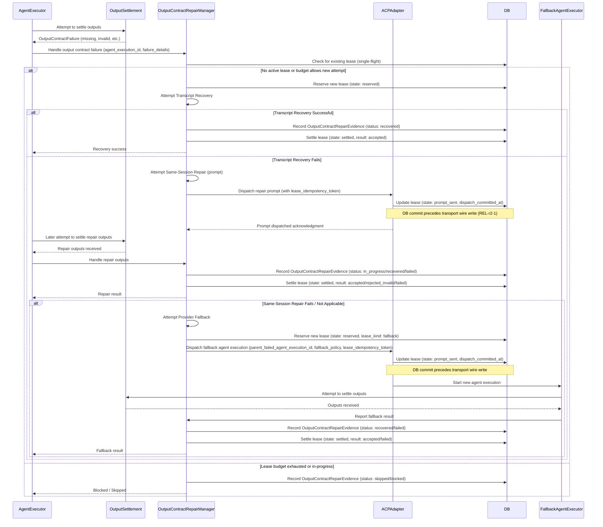

# Proposal 079: Contract-Aware Output Repair and Provider Fallback

| Field | Value |
|---|---|
| Proposal ID | P079 |
| Revision | p079-contract-aware-output-repair-and-provider-fallback-r5 |
| Date | 2026-05-30 |
| Status | Partially Implemented |
| Source review pass | f5d0824f-9086-4d1f-99b7-f6e42b5cb945 |
| Primary gate | `./scripts/test-gate.sh proposal-079` and `./scripts/test-gate.sh p079` |
| Related | P027, P029, P086, P088, P095, output settlement, artifact claims, auto-retry observation ledger, executable rollout gate |

## Problem

Chainworks can complete useful provider work and still block a run because the final declared output set is missing, empty, invalid, emitted through the wrong provider mode, or stranded in the current provider envelope. Normal output settlement already validates declared outputs and source-generation ownership, but the recovery lane after a contract failure is not fully governed. That creates a costly path: the provider does substantial work, settlement rejects the required output envelope, the stage blocks, and a later retry repeats work while losing same-session context.

P079 treats this as an invocation settlement problem. It adds a bounded recovery lane after normal output collection fails and before the run is durably blocked for an output-contract failure. It does not replace normal output collection, human approvals, workflow-conflict mediation, release safety, or quality retries.

## Goals

- Attempt at most one same-session corrective output repair turn for eligible missing, empty, invalid, or mode-mismatched required outputs.
- Recover contract-valid output already present in the current invocation transcript or provider result envelope when it is attributable to the current agent execution by transport-allocated identifiers.
- Allow at most one controlled provider fallback attempt after repair or recovery is unavailable or unsuccessful, and only from frozen fallback policy.
- Provide operators with full visibility and control over all contract-aware output repair, recovery, and fallback attempts via GraphQL and MCP.
- Ensure the MacOS app can display readback of repair and fallback attempts, their status, and recommended next actions, distinguishing between informational, recovered, blocked, skipped, cancelled, and failed categories.

## Design

### High-level Overview

P079 introduces a `OutputContractRepair` evidence object, persisted in SQLite, which tracks attempts to recover from output contract failures. This involves a sequence of escalating recovery strategies:

1.  **Transcript Recovery**: Attempt to find contract-valid output within the current invocation's transcript.
2.  **Same-Session Repair**: A prompt-based repair attempt within the same agent session.
3.  **Provider Fallback**: If same-session repair fails, dispatch a new agent execution with a specialized fallback policy.

The entire process is bounded by budgets, policy, and permissions. All actions are observable via GraphQL/MCP/run-report.

### Components

-   **`output_contract_repair_events` table**: Stores `OutputContractRepairEvidence` objects.
    -   `repair_attempt_id` (PK), `run_id`, `stage_execution_id`, `agent_execution_id` (FK to parent failed execution).
    -   `status`, `initial_failure_class`, `recommended_next_action`, `presentation_category`.
    -   JSON blobs for `same_session_repair`, `transcript_recovery`, `provider_fallback`, `provider_plan_evidence`, `budget`, `lease`, `permission_decisions`.
-   **`output_contract_repair_leases` table**: Manages single-flight dispatch of repair/fallback.
    -   `lease_key` (PK), `state` (reserved, prompt_sent, settled), `expires_at`, `owner_principal_id`.
-   **`output_contract_repair_fallback_parent_links` table**: Links fallback child executions to their parent failed executions.
-   **`OutputContractRepairEvidence`**: The main data structure for tracking repair attempts.
-   **ACP Adapter**: Handles dispatching repair prompts and fallback executions.
-   **GraphQL Schema**: Exposes `OutputContractRepairEvidence` via `AgentExecution.outputContractRepair`.
-   **MCP Reports**: `mcp reports get {run_id}` includes `output_contract_repair` data.
-   **SwiftUI DTOs**: For displaying repair status in the macOS app.
-   **SQLite Migration**: `p079_output_contract_repair_v1` adds the new tables.

### Sequence Diagram (Simplified)

## Rollout Contract

See the `rollout_contract_v1` section in the approved proposal JSON for full details, including:

-   **Gate Commands**: `./scripts/test-gate.sh proposal-079` and `./scripts/test-gate.sh p079`
-   **Migrations**: `p079_output_contract_repair_v1` SQLite migration.
-   **Metrics**: `p079_output_repair_attempt_total`, `p079_transcript_recovery_total`, etc.
-   **Readback Lanes**: `run_report`, `mcp`, `graphql`.
-   **Hold Conditions**: Detailed rules for preventing unsafe behavior (e.g., bypassing contract validation, side-effect lanes).
-   **Rollback Disposition**: `feature_flag_disable_keep_evidence_readback`.

## GraphQL Schema Appendix

See the `graphql_sdl_appendix` section in the approved proposal JSON for the full GraphQL SDL, including:

-   `OutputContractRepairEvidence` type.
-   Nested types like `OutputContractRepairAttempt`, `OutputContractTranscriptRecovery`, `OutputContractProviderFallback`.
-   Enums for `OutputContractRepairStatus`, `InitialFailureClass`, `ProviderFamily`, etc.
-   Parent field extension: `extend type AgentExecution { outputContractRepair: OutputContractRepairEvidence }`.
-   Nullability rules, compatibility notes, and SDL parity fixture details.

## SQLite Migration Appendix

See the `sqlite_migration_appendix` section in the approved proposal JSON for full details, including:

-   Table schemas for `output_contract_repair_events`, `output_contract_repair_leases`, `output_contract_repair_fallback_parent_links`.
-   Columns, primary keys, unique constraints, foreign keys, and indexes for each table.
-   Check constraints for enum fields.
-   Transactional invariants for lease management.
-   Rollback and read compatibility rules for old-run and feature-disabled rowsets.

## MacOS Client Readback

The macOS app (SwiftUI) consumes the GraphQL readback to display P079 evidence.

-   **Presentation**: Primary badges bind to `presentation_category` and `recommended_next_action`. Inspectors group fields under Diagnostics, Execution Details, and Evidence.
-   **Identity Contract**: SwiftUI row identity is `(repair_attempt_id, agent_execution_id)`; `evidence_version` is a content-version field.
-   **Decode Gate**: `./scripts/test-gate.sh p079-swift-readback` compiles the DTO module and runs decode fixtures.
-   **SwiftData Invalidation**: P079 evidence is not canonical SwiftData truth; ephemeral read-model caches invalidate on `evidence_version` or `projection_integrity` changes.
