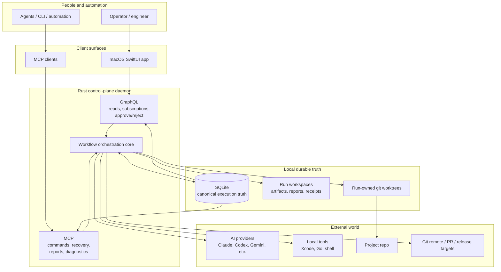
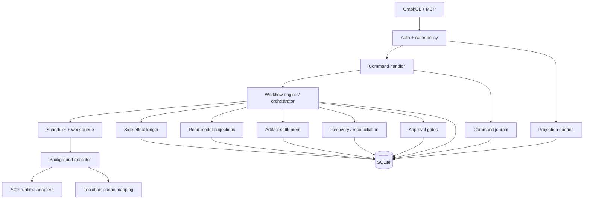
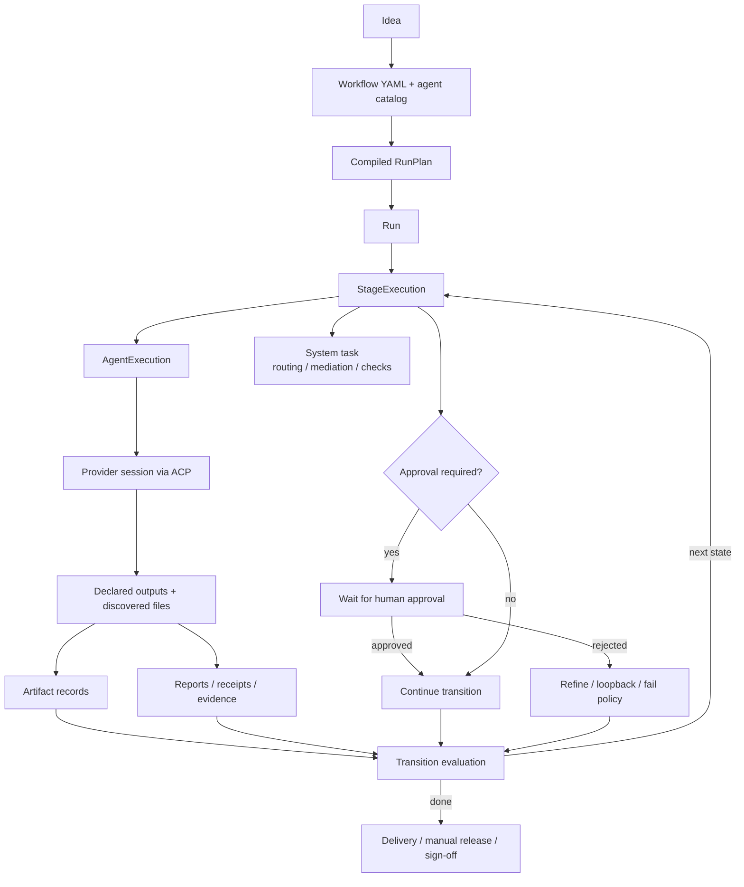

# Service Architecture Overview

High-level map of how Chainworks Forge works as a local orchestration service:
what orchestrates work, which entities own truth, and where the system interacts
with the outside world.

## System Boundary

The service has two northbound surfaces: GraphQL for the governed macOS UI and
MCP for operational control by agents, CLI, and automation.

The Rust control-plane daemon is the orchestrator. The governed macOS UI is not
the orchestrator: it reads GraphQL projections and may only settle approval gates
through `approveApproval` / `rejectApproval`. Non-approval operational commands
belong to MCP, with the narrow exception of the P083 operator GraphQL lifecycle
mutations (provider shutdown, process-absent confirmation, rollback execution,
enforcement-mode changes, and run retry) reserved for explicitly authorized
non-UI operator callers.

Inside the daemon, command handling, scheduling, execution, recovery, artifact
settlement, and projections all converge on SQLite as canonical truth.

## Execution Entities

## Core Entities

| Entity | Role |
|---|---|
| `Idea` | Operator-owned work request that starts the process. |
| `Workflow YAML` | Declarative workflow topology, stages, transitions, loops, and approval gates. |
| `Agent catalog` | Agent definitions, provider bindings, output contracts, and runtime policy. |
| `RunPlan` | Compiled immutable execution topology for a run. |
| `Run` | Durable execution aggregate for one workflow launch. |
| `StageExecution` | One attempt to execute a workflow state. |
| `AgentExecution` | One agent or system-task execution inside a stage attempt. |
| `Approval` | Human gate that pauses or redirects execution. |
| `Artifact` | Durable output metadata and linkage to run/stage/agent truth. |
| `Report` | Operator-facing receipts, summaries, diagnostics, and evidence. |
| `Command journal` | Durable audit trail for MCP/command-handler mutations. |
| `Side-effect ledger` | Durable guard for externally visible operations such as push, upload, and release. |
| `SQLite` | Canonical local execution truth. |
| `GraphQL projection` | Read model consumed by the macOS UI. |
| `MCP tool` | Command/control and diagnostics surface for agents, CLI, and automation. |

## Boundary Summary

- SwiftUI reads workflow truth through GraphQL projections.
- SwiftUI writes are limited to approval settlement.
- MCP owns create/start/cancel/retry/recovery/report/control operations.
- SQLite is internal daemon storage, not an operator API.
- Provider execution happens through ACP runtime adapters.
- External side effects must be represented in durable service truth before they
  are retried or reconciled.
